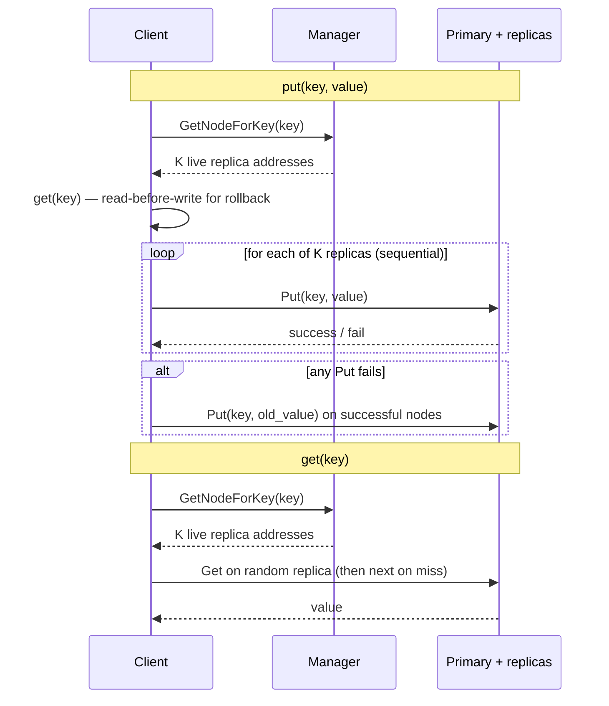

# GTStore

**A distributed, replicated, in-memory key-value store in C++ with gRPC.**

Course project for Georgia Tech *Advanced Operating Systems* (Project 4). Explores how to partition data across nodes, keep K replicas consistent under failure, and recover lost partitions — without shared memory or a filesystem as the control plane.

Implementation lives in [`gtstore/`](gtstore/).

### What this demonstrates

- **gRPC service design** — separate `ManagerService` / `StorageService` stubs for membership, key placement, Put/Get, heartbeats, and bucket transfer
- **Static hash sharding** — `hash(key) % N` maps keys to primary partitions; N buckets = N nodes fixed at startup
- **Ring-based replica placement** — each key lives on primary `i` and the next `K−1` live nodes on a logical ring
- **Client-driven write-all + read-any** — puts succeed only after all K replicas acknowledge; gets pick a random replica and fall through on miss
- **Failure detection & recovery** — manager heartbeats every 3s (1s deadline); on death, copies affected buckets from a live backup to a new target to restore the K-replica count
- **Bucket-level locking** — per-partition `mutex` so concurrent puts to different shards on the same node do not contend

---

## Architecture: Manager, Storage Nodes, Client Library

**Three process types talk only over gRPC** (no shared memory / local files for data path).

| Component | Role |
|-----------|------|
| **Manager** (`manager`) | Membership, key→replica lookup, heartbeat monitor, failure recovery orchestration |
| **Storage nodes** (`storage`) | In-memory KV maps, one bucket per partition; serve Put/Get/Ping/TransferData |
| **Client library** (`client.cpp`) | `init` / `put` / `get` / `finalize`; clients own write/read orchestration |

Each storage node holds **N buckets**. Bucket `i` is the primary partition for node `i`; other nodes that are replicas of partition `i` store the same keys in their local bucket `i`. That layout makes recovery a bucket copy rather than a full-key scan.



---

## Design Decisions & Tradeoffs

### Partitioning: static modulo hash — O(1) lookup, fixed cluster size

**Keys map with `hash(key) % N`, where N is set when the manager starts and never changes.** Lookup is cheap and deterministic, and a 100k-key load-balance run on 7 nodes spreads keys roughly evenly (~14k per node).

**Cost:** adding or removing nodes after startup would invalidate placements; there is no consistent hashing and no live reshard. Cluster size is a boot-time constant.

### Replication: ring placement of K copies — survive up to K−1 node deaths

**For primary bucket `b`, replicas are the next live nodes walking `(b + i) % N`.** The manager returns only alive addresses, so under failure the client may write to fewer than K nodes if not enough remain.

**Cost:** each put fans out to K nodes; storage grows linearly with K; recovery must restore *K* affected partitions per death (the dead node’s primary plus the K−1 partitions it held as a replica).

### Consistency: write-all, read-any — strong reads, higher put latency

**A put returns success only if every returned replica accepts the write.** Because all live copies are updated before success, any successful get against a replica that has the key sees the latest committed value.

**Partial-write handling:** the client does a **read-before-write**, then on a mid-fanout failure **rolls back** already-written nodes to the prior value (up to 3 retries). This is best-effort client-side undo, not a distributed transaction.

**Cost:** put latency is roughly the sum of sequential Put RPCs (plus that preparatory get). Availability of writes drops if any replica in the set is unreachable — consistency is preferred over continuing with a partial quorum.

### Locking: per-bucket mutexes — concurrency within a node

**Each bucket has its own lock**, so concurrent ops on different partitions on the same process do not block each other.

**Cost:** N mutexes per node and more lock bookkeeping than a single node-wide lock.

---

## Performance Results

Measured with `performance_test throughput`: **200,000 ops**, **50% put / 50% get**, **7 storage nodes**, varying K. (Verbose client logging disabled for these runs.)

| Replication factor (K) | Throughput |
|------------------------|------------|
| 1 | **2561** ops/sec |
| 3 | **1643** ops/sec |
| 5 | **1199** ops/sec |

**Why throughput falls as K grows:** each put must contact K nodes sequentially, so write cost scales with K while gets stay ~constant (one successful replica). **Additionally, every put issues a get first** for rollback state — that read tax is paid even at K=1, so replication overhead is not the only drag on write path performance.

---

## Known Limitations

- **Rollback is client-local.** If the client dies mid-rollback, replicas can diverge; there is no coordinator or WAL to finish undo.
- **Manager is a single point of failure.** If it dies, placement, heartbeats, and recovery stop; clients cannot proceed.
- **No elastic membership.** N and bucket count are fixed at manager init; dead nodes are marked dead and data is re-placed among survivors, but the cluster does not grow or rehash.
- **K=1 means permanent loss on failure.** With one copy, recovery correctly skips — there is no backup to copy from.
- **Insecure gRPC / single-machine processes.** Fine for the course harness; not a production security or deployment model.

---

## In the future, I will...

1. **Replicate or elect the manager** so control-plane failure is not fatal.
2. **Move to consistent hashing** (or virtual nodes) so the cluster can resize without a full re-shard.
3. **Replace read-then-rollback** with a write-ahead log or two-phase commit so durability and atomicity do not depend on the client staying alive.
4. **Parallelize the K Put RPCs** (or pipeline them) once atomicity is handled server-side, to cut write latency without weakening the write-all guarantee.

---

## Build & Run

**Requirements:** C++17, `g++`, `protoc`, gRPC C++ (`pkg-config` for `protobuf` / `grpc` / `grpc++`).

```bash
cd gtstore
make            # builds bin/manager, bin/storage, bin/test_app, bin/performance_test
./cleanup.sh    # kill leftover manager/storage/test_app processes
```

**Start a cluster** (example: 7 nodes, replication factor 3):

```bash
./bin/manager -n 7 -k 3 &          # or: --nodes 7 --rep 3
# manager listens on 0.0.0.0:50051

./bin/storage --port 50052 &
./bin/storage --port 50053 &
# ... up to N nodes on consecutive ports
```

**Client / tests:**

```bash
./bin/test_app single_set_get <client_id>
./bin/test_app --put <key> --val <value>
./bin/test_app --get <key>

./run.sh        # clean build + small multi-client smoke test
./test4.sh      # N=7, K=3; populate, kill nodes, verify gets after recovery

./bin/performance_test throughput
./bin/performance_test loadbalance 7
```

Keys ≤ **20 bytes**, values ≤ **1 KB** per request (enforced in the client).

---

## Tech stack

**C++17 · gRPC · Protocol Buffers · `std::thread` / `std::mutex` · in-process multi-node simulation over TCP**
